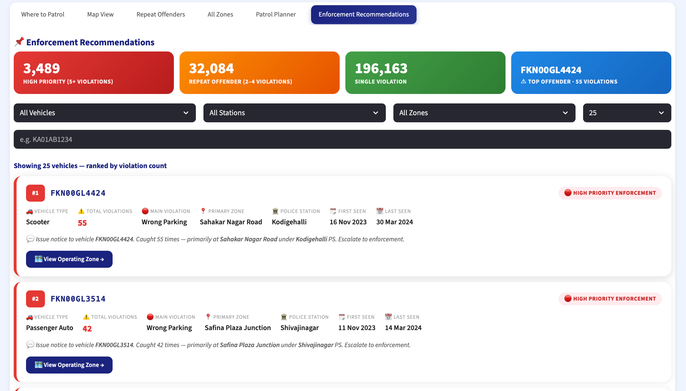
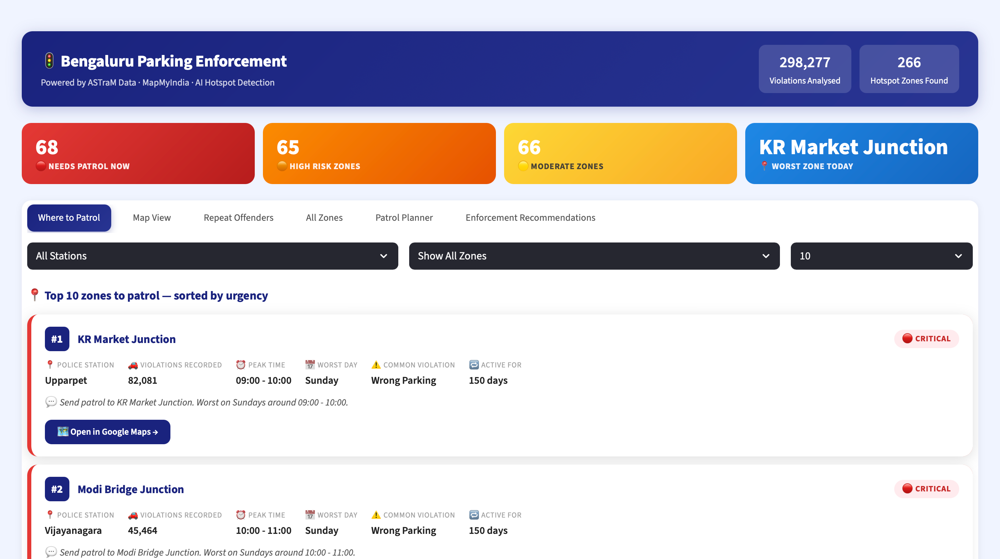
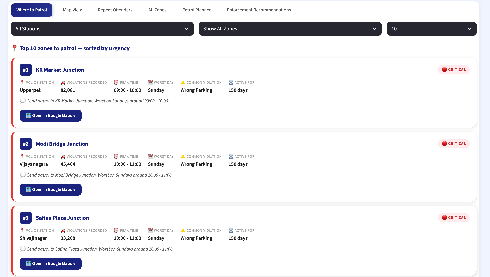
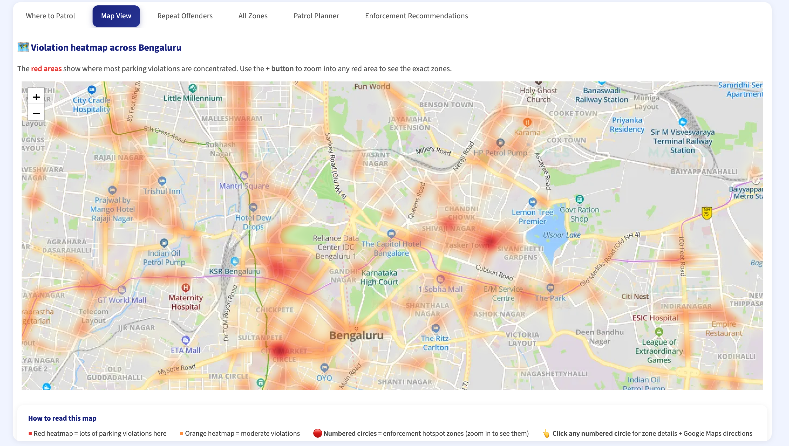
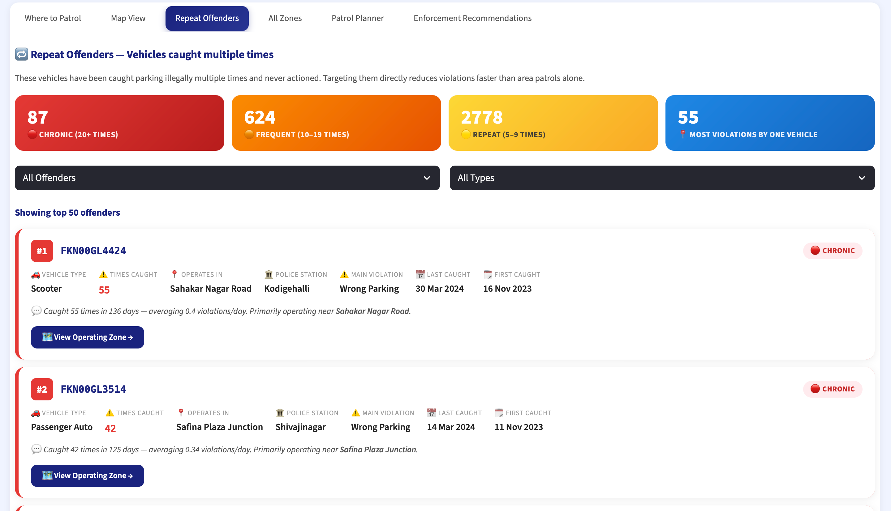
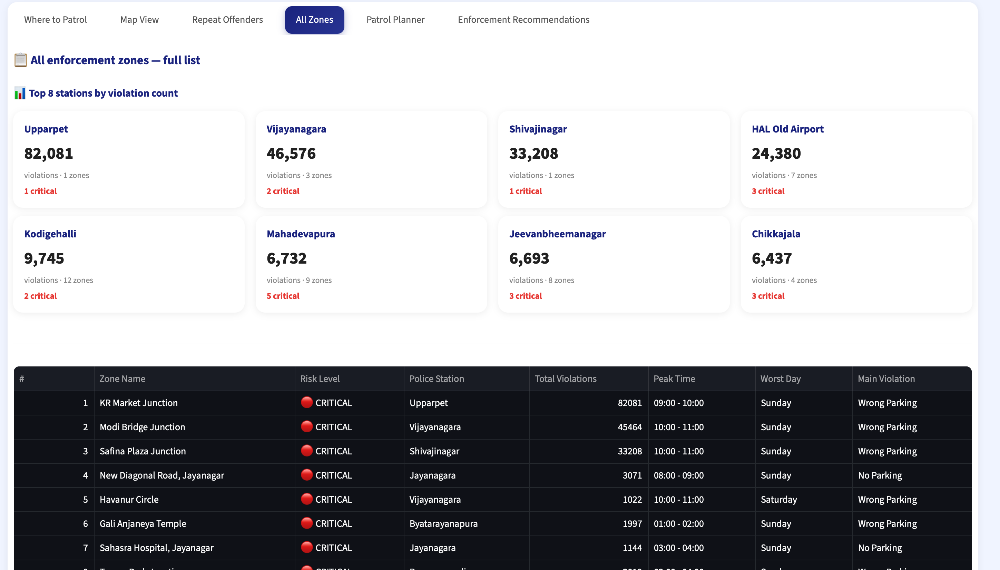
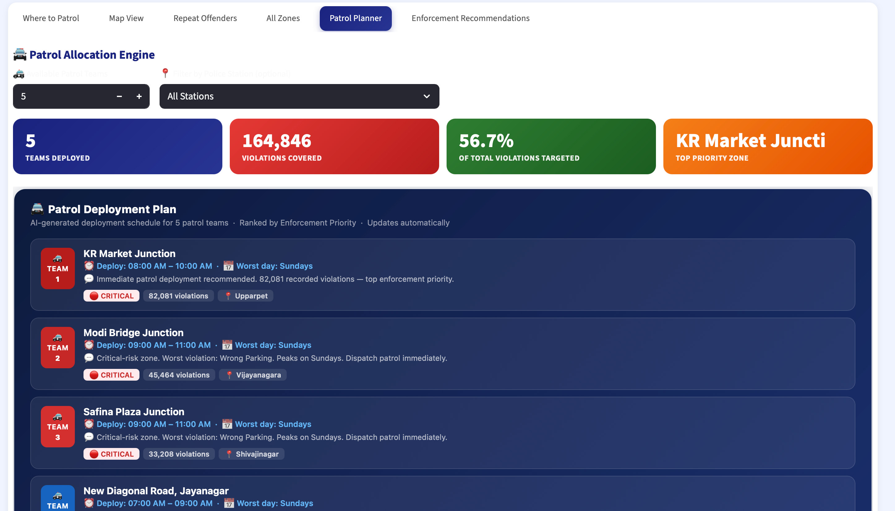

# Bengaluru Parking Intelligence System — ParkIntel
**Flipkart GridLock 2.0 — Round 2 Submission**

AI-powered parking violation hotspot detection and enforcement intelligence system for the Bengaluru Traffic Police (ASTraM).

---

## Problem Statement

Bengaluru traffic police enforce parking violations reactively through manual patrols, with no data-driven system to identify where violations are worst, when they peak, or which zones cause the most congestion.

ParkIntel uses 298,000+ real ASTraM violation records to tell enforcement commanders exactly **where to deploy officers, when, and why** — transforming reactive enforcement into proactive, data-driven policing.

---

## Dashboard Preview



### Where to Patrol


### Map View


### Repeat Offenders


### All Zones


### Patrol Planner


### Enforcement Recommendations


| Tab | Description |
|-----|-------------|
| Where to Patrol | Top hotspot zones ranked by urgency, filterable by station and risk level |
| Map View | Live heatmap of all violations across Bengaluru with clickable zone markers |
| Repeat Offenders | Vehicles caught multiple times, ranked and tiered for targeted action |
| All Zones | Full table of 266 detected hotspot zones with export to CSV |
| Patrol Planner | AI-generated deployment schedule for N patrol teams |
| Enforcement Recommendations | Vehicle-level enforcement prioritization with action guidance |

---

## Dataset

The raw dataset (104 MB) exceeds GitHub's file size limit and is hosted separately.

**Download:** [ASTraM Violation Records — Google Drive](https://drive.google.com/drive/folders/1b_mNkSGSLRn79pzRD1MDF4lCxEz3RvKx?usp=share_link)

Place the downloaded CSV in:
```
dataset/jan to may police violation_anonymized791b166 (1).csv
```

---

## Setup

### 1. Install dependencies
```bash
pip3 install -r requirements.txt
```

### 2. Add your MapMyIndia API key
Create a `.env` file in the root directory:
```
MAPPLS_API_KEY=your_key_here
```

### 3. Run the pipeline (one time only)
```bash
python3 run_pipeline.py
```
This processes the raw CSV and generates all required data files in `data/processed/`.

### 4. Launch the dashboard
```bash
streamlit run dashboard/app.py
```
Open [http://localhost:8501](http://localhost:8501) in your browser.

---

## Project Structure

```
├── dataset/                         # Raw ASTraM violation data (download separately)
├── pipeline/
│   ├── 01_clean_and_score.py        # Data cleaning + severity scoring
│   ├── 02_cluster_hotspots.py       # DBSCAN spatial clustering
│   ├── 03_pii_scoring.py            # Zone scoring and risk classification
│   ├── 04_temporal_analysis.py      # Peak hour and day analysis
│   └── 05_repeat_offenders.py       # Repeat offender profiling
├── dashboard/
│   ├── app.py                       # Streamlit dashboard (6 tabs)
│   └── patrol_allocation.py         # Patrol deployment engine
├── data/processed/                  # Generated by pipeline (not committed)
├── run_pipeline.py                  # Master pipeline runner
├── requirements.txt
└── .env                             # API keys (not committed)
```

---

## Key Results

- **266 hotspot zones** detected across Bengaluru using DBSCAN clustering
- **#1 Critical Zone:** KR Market Junction — 82,081 violations
- **3,489 vehicles** flagged as High Priority Enforcement (5+ violations)
- **32,084 vehicles** identified as Repeat Offenders (2–4 violations)
- **Peak violation window:** 10 AM – 4 PM (Afternoons)
- **Worst day:** Sundays (commercial and market area spillover)
- **Top enforcement station:** Upparpet

---

## How It Works

```
Raw CSV (298,277 records)
        ↓
01. Clean + Score         — parse violations, compute severity per record
        ↓
02. Cluster Hotspots      — DBSCAN spatial clustering → 266 zones
        ↓
03. Zone Scoring          — rank zones by violation frequency, severity, time patterns
        ↓
04. Temporal Analysis     — identify peak hours and worst days per zone
        ↓
05. Repeat Offenders      — group by vehicle, tier by violation count
        ↓
Dashboard (Streamlit)     — 6-tab enforcement intelligence interface
```

---

## Tech Stack

| Component | Technology |
|-----------|-----------|
| Data Processing | Python, Pandas, NumPy |
| Spatial Clustering | Scikit-learn (DBSCAN) |
| Dashboard | Streamlit |
| Maps | Folium, MapMyIndia (Mappls) |
| Data Source | ASTraM — Bengaluru Traffic Police |

---

## Data Sources

- **ASTraM / Bengaluru Traffic Police** — 298,277 parking violation records (Jan – May 2024)
- **MapMyIndia (Mappls)** — Map tiles and navigation API
